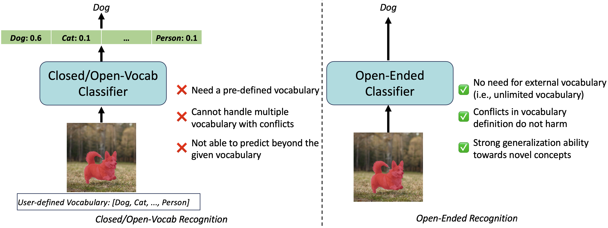
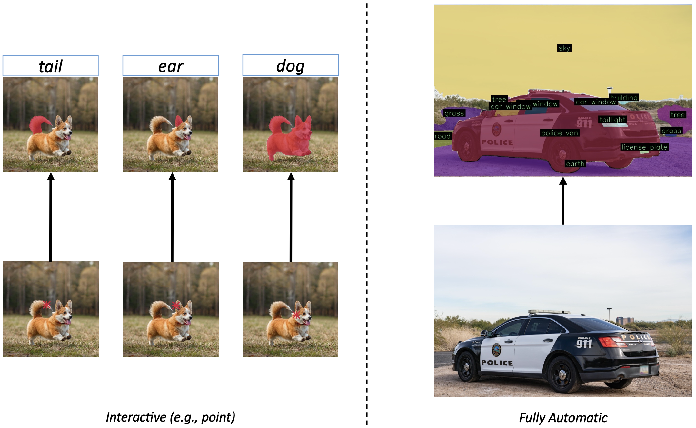

# OmniScient-Model
 
This repo contains the code for our paper [**Towards Open-Ended Visual Recognition with Large Language Model**](https://arxiv.org/abs/2311.08400)

<div align="center">
  
</div><br/>

We propose OmniScient Model (OSM) towards open-ended visual recognition, allowing the identification of diverse real-world entities without the constraints of a user-defined vocabulary. Unlike closed-vocabulary and open-vocabulary recognition frameworks, OSM operates seamlessly without the need for predefined vocabularies.


<div align="center">
  
</div><br/>

### Features
* A simple strategy to adapt multi-modal LLM for high-resolution image at 1120x1120, leading to more precise recognition ability.

* A brand-new task named open-ended visual recognition to predict beyond the limitation of a given vocabulary.

* A strong model that can recognize novel concepts in the real-world, e.g., it can recognize semantic parts even when only trained on object-level data.

## Installation

```bash
pip install torch==2.0.1 torchvision==0.15.2
pip install -r requirments.txt
```

## Getting Started

We provide examples applying OSM on top of an off-the-shelf segmenter (e.g., SAM), illustrating playing with OSM in a segment and recognize anything mode in [demo_with_sam.py](./demo_with_sam.py), or in an interactive model in [interactive_demo.ipynb](./interactive_demo.ipynb).

## Data Preparation

Please refer to [Preparing Datasets for OSM](dataset_preparation/README.md).

## Training

After finishing the data preparation, you can use the following commands to train OSM model with 8 A100 GPUs in 2 days, and you can adjust the gradient accumulation, FSDP, gradient checkpointing per your computational resources.

To train OSM-final w/o part segmentation or detection data:
```bash
torchrun --nnodes=1 --nproc_per_node=8 --master_addr=127.0.0.1 --master_port=9999 --node_rank=0 \
  train/train.py \
  --dataset_resampled \
  --batch_size_coco 8 \
  --batch_size_lvis 16 \
  --batch_size_a847 4 \
  --batch_size_pc459 2 \
  --batch_size_ade20k 4 \
  --batch_size_cityscapes 2 \
  --train_num_samples_coco 100000 \
  --train_num_samples_lvis 200000 \
  --train_num_samples_a847 50000 \
  --train_num_samples_pc459 25000 \
  --train_num_samples_ade20k 50000 \
  --train_num_samples_cityscapes 25000 \
  --workers 4 \
  --run_name osm_final \
  --num_epochs 10 \
  --warmup_steps 100 \
  --weight_decay 0.05 \
  --lr_scheduler cosine \
  --coco_shards "$SAVE_PATH/coco_pan_wds_exclude_lvisval/{000000000..000000106}.tar" \
  --lvis_shards "$SAVE_PATH/lvis_wds/{000000000..000000099}.tar" \
  --a847_shards "$SAVE_PATH/a847_wds/{000000000..000000025}.tar" \
  --pc459_shards "$SAVE_PATH/pc459_wds/{000000000..000000004}.tar" \
  --ade20k_shards "$SAVE_PATH/ade20k_pan_wds/{000000000..000000020}.tar" \
  --cityscapes_shards "$SAVE_PATH/cityscapes_pan_wds/{000000000..000000002}.tar" \
  --learning_rate 4e-5 \
  --precision amp_bfloat16 \
  --gradient_accumulation_steps 4
```

To train OSM-final w/ part segmentation and detection data:
```bash
torchrun --nnodes=1 --nproc_per_node=8 --master_addr=127.0.0.1 --master_port=9999 --node_rank=0 \
  train/train.py \
  --dataset_resampled \
  --mask2box_prob 0.2 \
  --batch_size_coco 8 \
  --batch_size_lvis 16 \
  --batch_size_a847 4 \
  --batch_size_pc459 2 \
  --batch_size_ade20k 4 \
  --batch_size_cityscapes 2 \
  --batch_size_v3det 16 \
  --batch_size_partimagenet 4 \
  --batch_size_pascal_part 2 \
  --train_num_samples_coco 100000 \
  --train_num_samples_lvis 200000 \
  --train_num_samples_a847 50000 \
  --train_num_samples_pc459 25000 \
  --train_num_samples_ade20k 50000 \
  --train_num_samples_cityscapes 25000 \
  --train_num_samples_v3det 200000 \
  --train_num_samples_partimagenet 50000 \
  --train_num_samples_pascal_part 25000 \
  --workers 4 \
  --run_name osm_final_partseg_det \
  --num_epochs 10 \
  --warmup_steps 100 \
  --weight_decay 0.05 \
  --lr_scheduler cosine \
  --coco_shards "$SAVE_PATH/coco_pan_wds_exclude_lvisval/{000000000..000000106}.tar" \
  --lvis_shards "$SAVE_PATH/lvis_wds/{000000000..000000099}.tar" \
  --a847_shards "$SAVE_PATH/a847_wds/{000000000..000000025}.tar" \
  --pc459_shards "$SAVE_PATH/pc459_wds/{000000000..000000004}.tar" \
  --ade20k_shards "$SAVE_PATH/ade20k_pan_wds/{000000000..000000020}.tar" \
  --cityscapes_shards "$SAVE_PATH/cityscapes_pan_wds/{000000000..000000002}.tar" \
  --v3det_shards "$SAVE_PATH/v3det_wds/{000000000..000000183}.tar" \
  --partimagenet_shards "$SAVE_PATH/part_imagenet_wds/{000000000..000000020}.tar" \
  --pascal_part_shards "$SAVE_PATH/pascal_part_wds/{000000000..000000008}.tar" \
  --learning_rate 4e-5 \
  --precision amp_bfloat16 \
  --gradient_accumulation_steps 4
```

## Testing

Update the data path in [test/generate_pred.py](test/generate_pred.py), then run the following script for testing:
```bash
GPU_COUNT=8  # Set your GPU count here
CKPT_PATH="./osm_final.pt"  # Set your checkpoint path here
RESULT_SAVE_PATH="osm_final"  # Set your result save path here

for (( i=0; i<GPU_COUNT; i++ )); do
    CUDA_VISIBLE_DEVICES=$i python3 test/generate_pred.py $i $GPU_COUNT $CKPT_PATH $RESULT_SAVE_PATH &
done

wait # This will wait for all the background jobs to finish

python3 test/evaluate_pred.py $RESULT_SAVE_PATH $GPU_COUNT

```

## Model Zoo

<table>
<thead>
  <tr>
    <th align="center" style="text-align:center">Checkpoint</th>
    <th align="center" style="text-align:center">Training Datasets</th>
  </tr>
</thead>
<tbody>
    <tr>
        <th align="center" style="text-align:center"><a href="https://drive.google.com/file/d/1ObaklM3NohoPIm_IaTde0RbCefZC8RtL/view?usp=drive_link"> OSM </th>
        <th align="center" style="text-align:center">COCO Panoptic, ADE Panoptic, Cityscapes Panoptic, LVIS Instance, A-847 Semantic, PC-459 Semantic</th>
    </tr>
    <tr>
        <th align="center" style="text-align:center"><a href="https://drive.google.com/file/d/1mGlvlfPR2MTTUuLpiklUrmSziBFai4-Z/view?usp=drive_link"> OSM w/ part and box</th>
        <th align="center" style="text-align:center">COCO Panoptic, ADE Panoptic, Cityscapes Panoptic, LVIS Instance, A-847 Semantic, PC-459 Semantic, Part-ImageNet Semantic, Pascal-Part Semantic, V3Det Detection</th>
    </tr>
</tbody>
</table>

## Visual Results

<div align="center">
  
</div><br/>
<div align="center">
  
</div><br/>
<div align="center">
  
</div><br/>

## <a name="Citing OSM"></a>Citing OSM

If you use OSM in your research, please use the following BibTeX entry.

```BibTeX
@inproceedings{yu2023towards,
  title={Towards Open-Ended Visual Recognition with Large Language Model},
  author={Qihang Yu and Xiaohui Shen and Liang-Chieh Chen},
  booktitle={arxiv: 2311.08400},
  year={2023}
}
```

## Acknowledgement

[Segment Anything](https://github.com/facebookresearch/segment-anything)

[OpenFlamingo](https://github.com/mlfoundations/open_flamingo)
